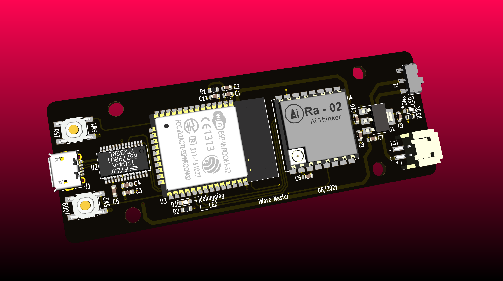

# i-wave
The repo contains firmware codes for both master and slave devices that monitor battery SoH among other parameters needed from a UPS set. 
Everything on how to program and what the codes does is documented sequenctially in this repo
## Battery Monitoring System 
## Master
</img> 
