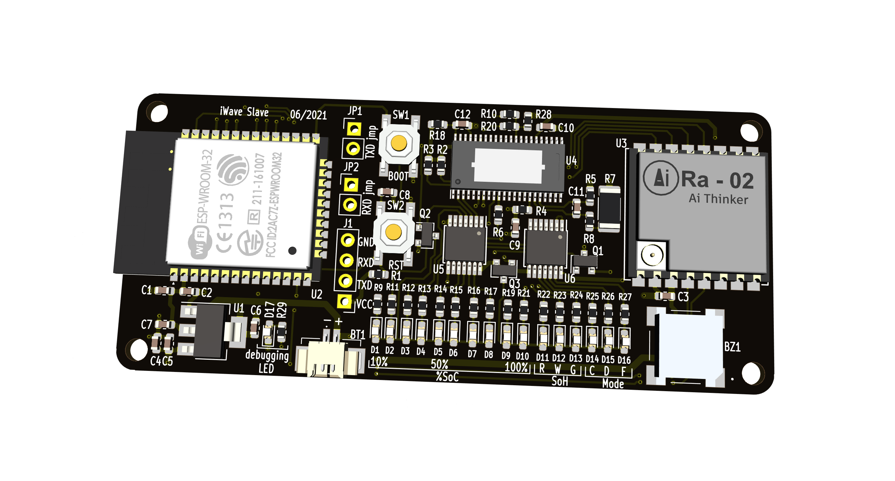

# i-wave
The repo contains firmware codes for both master and slave devices that monitor battery SoH among other parameters needed from a UPS set. 
Everything on how to program and what the codes does is documented sequentially in this repo.
The data from the slaves to the master is transferred wirelessly via LoRa where it's then logged to some server.
## Battery Monitoring System 

## Master

The master consists of an ESP32 as the main MCU and the WiFi gateway for server communications. It also got a LoRa module that receives the data wirelessly from the slave module(s) that monitors of the individual batteries.

</img> 

Programming
---
- The IDE to be used for this development is [Arduino IDE](https://www.arduino.cc/en/software) Atmel Studio Can also be used as well. 
- The PCB has Micro USB interface as the programming interface, if you don't have familiarity with the software you can pick up on this :link:[tutorial](https://www.youtube.com/watch?v=nL34zDTPkcs&t=3s)

- Download all the files on the `Code`:arrow_down_small: on the platform, In your downloads you will get the a folder :file_folder:  `i-wave-master` this will have all the codes and related libraries.
- On library installation unzip the folder :file_folder: `libs` copy and paste all the folders to your directory `documents/arduino/library` folder :file_folder:
- Open the `.ino` file for i-wave-master with the downloaded and ide, compile and uplaod to the hardware `(procedure on how to use the ide is on the tutorial link)`:link:    [tutorial](https://www.youtube.com/watch?v=nL34zDTPkcs&t=3s)

OTA
---
- AsyncElegantOTA provides a beautiful interface to upload Over the Air `.bin` updates to your ESP Modules with precise status and progress displayed over UI. This Library shows the current upload progress of your OTA and once finished, it will display the status of your OTA. This Code adapts the AsyncWebServer.
- For more details on how it works visit the [repo](https://github.com/ayushsharma82/AsyncElegantOTA)

Slave
---

The slave also makes use of the ESP32 as the main controller unit, it makes use of a dedicated IC [bq78412](https://www.ti.com/lit/ds/symlink/bq78412.pdf?ts=1624178578744&ref_url=https%253A%252F%252Fwww.ti.com%252Fproduct%252FBQ78412) to perform the battery states monitoring, once all important data has been extracted it will be sent to the master via LoRa

</img> 
---

Programming
---
- The IDE to be used for this development is [Arduino IDE](https://www.arduino.cc/en/software) Atmel Studio Can also be used as well. 
- The PCB has UART interface as the programming interface, the programmer to be used for this case is a `USB - TTL converter` [buy here](https://www.aliexpress.com/item/32519490747.html?spm=a2g0o.productlist.0.0.1eb71275mA1FIm&algo_pvid=5b5fb98f-6760-4737-aece-bc19f81105e0&algo_exp_id=5b5fb98f-6760-4737-aece-bc19f81105e0-1)
- Download all the files on the `Code`:arrow_down_small: on the platform, In your downloads you will get the a folder :file_folder:  `i-wave-master` this will have all the codes and related libraries.
- On library installation unzip the folder :file_folder: `libs` copy and paste all the folders to your directory `documents/arduino/library` folder :file_folder:
- Open the `.ino` file for i-wave-slave with the downloaded ide, compile and uplaod to the hardware `(procedure on how to use the ide is on the tutorial link)` :link:  [tutorial](https://www.youtube.com/watch?v=nL34zDTPkcs&t=3s)

### Communications Interface
---
The `bq78412` provides a `UART` communications interface for parameter initialization during system config and test. This interface also provides real-time measurement capability and acess to stored battery performance data.

- To access the stored battery data from the `BQ78412`, default address is `0xFF` - it can be changed in parameter flash\
- Communication to the `BQ78412` is via messages
- The communication interface has a fixed data config 
    - 9600 or 1200 baud rate(set by DevConfig1[11])
    - 8 bits
    - No Parity 
    - 1 stop bit
    - No flow control
### Command Set & Status Reporting 
--- 
General Command Format Host to b17842
---
Address | ID | Param0 | Param1| Param2 | Param3 | Checksum 
------- | ---- | -------- | ------------- | ------- | ---- | --------
- The address is a hexadecimal number that distinguishes between target bq78412 devices. The `default address is 0xFF`
- The header ID is a hexadecimal number that distinguishes between individual commands.
- Checksum is XOR `"^"` of all bytes (excluding checksum) including header ID = 0xFF XOR Address XOR ID XOR
Param0 …..XOR Param3 

    - The bq78412 uses the `"!"` character as the `ACK` response code. Its value is `0x21`.
    - The bq78412 uses `0x15` as `NACK` response code.
 
Read Device Type and Version
---
Host to bq78412:
Address | 0x12 | 0x01 | 0x00| 0x00 | 0x00 | Checksum 
------- | ---- | -------- | ------------- | ------- | ---- | --------

Response from bq78412:
Address | ACK | "b" | "q"| "7" | "8" | "4" | "1" | "2" | Ver | Rev | Build| Checksum 
------- | ---- | -------- | ------------- | ------- | ---- | -------- |------- | ---- | -------- | ------------- | ------- | ---- 

`Note: Firmware version, revision & build are reported as hexadecimal numbers`

Reset bq78412
---
Host request to bq78412:
Address | 0x13 | 0x01 | 0x00| 0x00 | 0x00 | Checksum 
------- | ---- | -------- | ------------- | ------- | ---- | --------

Response from bq78412 to host:
Address | ACK | Checksum 
------- | ---- | --------

Initialize State-of-Charge (SoC)
---
This command initializes the SoC reported by the bq78412 to the SoC% parameter, forces the FCC to the value
in the DesignCapacity parameter, clears CycleCount, sets the last discharge to DesignCapacity/20, and initializes
all gas gauging variables to correspond to the written SoC level.

Host request to bq78412:
Address | 0x13 | 0x05 | 0x00| 0x00 | SoC% | Checksum 
------- | ---- | -------- | ------------- | ------- | ---- | --------

Response from bq78412 to host:
Address | ACK | Checksum 
------- | ---- | --------

## Status Broadcast (preferred approach)
- The bq78412 can be configured to automatically broadcast a status message block when `DevConfig1[0] = 1`.
This option allows the output of the UART to be connected to a wireless transmitter so battery status can be
remotely received and displayed.
- Automatic transmission of the broadcast status message block is `suspended for 60 seconds when a command is
received`, after transmission of the current frame is completed. `Automatic status transmission restarts a minimum
of 60 seconds after completion `of the response to the received command.
- The address is included in the status block since it may be desired to have one receiver unit monitor several batteries
- The table below lists the broadcast status message block words in the order that they are transmitted
- 

- While the broadcast message is being generated and transmitted, reception of commands is suspended,therefore, the response to the command sent may arrive after a broadcast message.

Battery Status Word
---
- The bq78412 maintains a 16-bit master battery status word. This word can be accessed at any time and is also transmitted in the broadcast status message block.
- The table below shows the descriptions of the "Battery Status Word"
- 

bq78412 Registers and Memory
---
- The bq78412 maintains the status of numerous battery performance variables in its on-chip registers. The `device registers are also used to retrieve the battery operational limits`
- `No password` is required to access these registers. The registers are `read-only`.
- `Battery information is retrieved by issuing message commands over the serial interface` to access the specific registers. `Registers can be read individually` or as a `sequential block of registers`. All registers are 16-bit registers or multiples of 16 bits

bq78412 Registers table
--

Abuse Counters
---
- The IC also keeps track of the amount of time the battery has spent outside recommended operationg conditions 
- Once every 6 min the attery is checked for abuse

The Abuse counters are
---
Counter | Abuse Registered
------- | ---- 
OtCount |Time temperature was above OtThresh 
UtCount | Time temperature was below UtThresh
OvCount | Time temperature was below UtThresh
UvCount | Time battery voltage was above OvThresh
OccCount | Time battery voltage was above OvThresh 
OcdCount | Time discharging current was above OcdThresh

Data Security 
---
- The bq78412 has three levels of data security: Levels 0, 1, and 2.
    - `SealedLevel0` is the fully unsealed mode where parameters are accessible and programmable under user control. `Upon initial power up, the bq78412 defaults to Level 0`, so that all parameters can be set and thedevice can be calibrated.
    - `SealedLevel1` is the partially sealed mode where the only parameters that can be modified are MultiDropAdr, InstallDate, ActivationDate, ActivationIndicator and MFGCodeSN, Level1Password. Several parameters can be read in this mode.
    - `SealedLevel2` is fully sealed mode where none of the parameters can be modified.

Configuring Secuirty Levels
--- 
- The seal level can be increased by sending any of the following commands to the bq78412 over the serial interface
       - `Set SealedLevel1 from SealedLevel0`: Sets the bq78412 to SealedLevel1 from SealedLevel0.
       - `Set SealedLevel2`: Sets the bq78412 to SealedLevel2 from SealedLevel0 or SealedLevel1.

Flash Parameters
---
The table below lists the bq78412 parameter set and the access control rules for each parameter.

[Table Continued]

[Table Continued]

